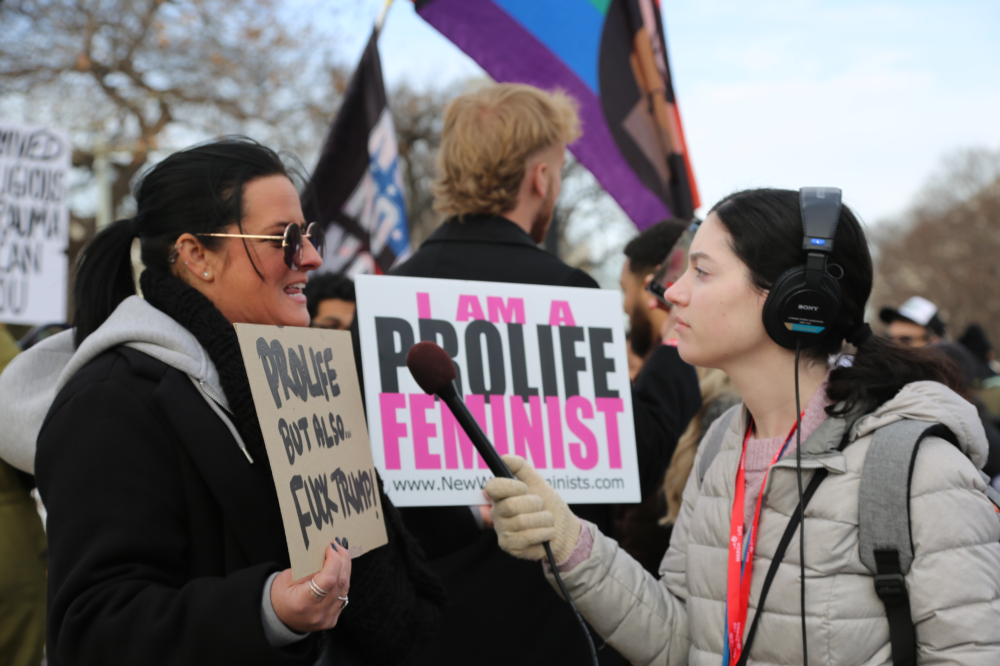

I stumbled into audio journalism on accident when one of my friends at The Daily Northwestern asked me to co-byline an audio story with her. Audio reporting opens up opportunities for people to immerse themselves in a story, and it's a tool I've found useful for reaching new audiences.

[***Prisoncast!*** **- WBEZ Chicago**](https://chicago.suntimes.com/2026/04/10/the-transportive-power-of-music-for-people-who-are-locked-up)

From September 2025 through December 2025, I traveled to Sheridan Correctional Center in Sheridan, Illinois about once a week to work on a *Prisoncast!* segment with incarcerated students. The segment, which I co-produced with WBEZ reporter Ari Mejia, aired on WBEZ Chicago on April 12, 2026.

To produce this piece, I worked with two incarcerated students to brainstorm story ideas, come up with interview questions and complete the interview process using a Zoom recorder inside the prison. Outside of the prison, I used Adobe Audition to put the segment together. The opportunity to work on this project strengthened my commitment to uplifting underrepresented voices and leading with curiosity instead of judgment or fear.

**More audio stories**

[A look into The Daily's coverage of the Deering Meadow encampment](https://dailynorthwestern.com/2024/04/27/campus/deering-encampment/a-look-into-the-dailys-pro-palestine-encampment-coverage/)

During a period of protest at Northwestern, I worked with top editors at The Daily Northwestern to give people who were not on campus a better idea of what was happening on the ground. This piece won [fifth place](https://studentpress.org/acp/2025/02/14/2024-multimedia-story-of-the-year-2/#podcast) in the ACP Multimedia Story of the Year podcast division for 2024.

[Listen: Gen Z pro-life activists, students convene for annual March for Life](https://medillonthehill.medill.northwestern.edu/2026/01/listen-gen-z-pro-life-activists-students-convene-for-annual-march-for-life/)

::: {layout-ncol="4"}

:::
