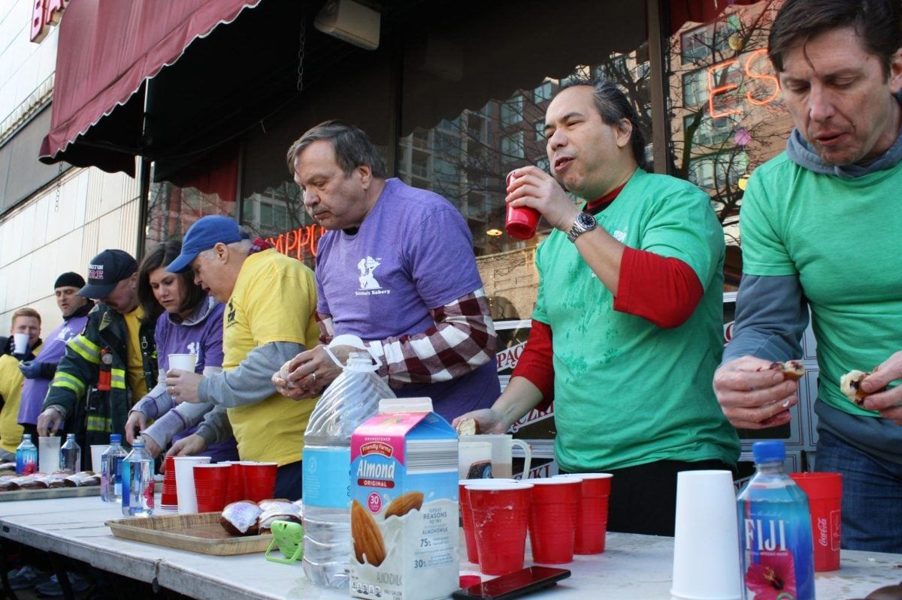
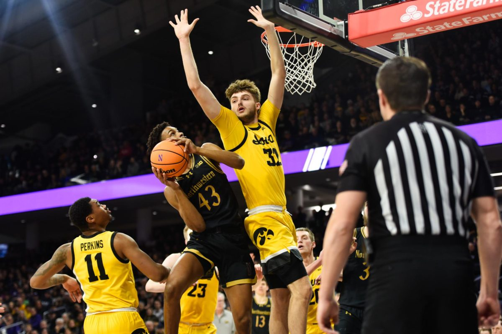
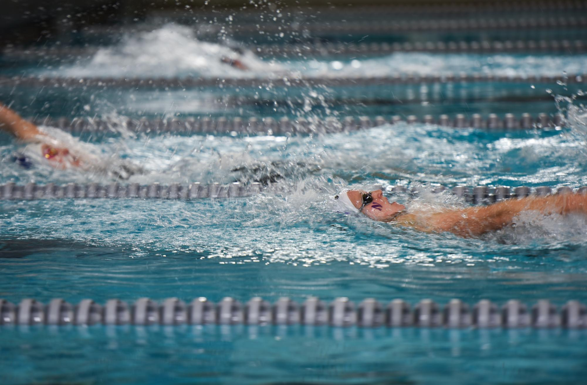
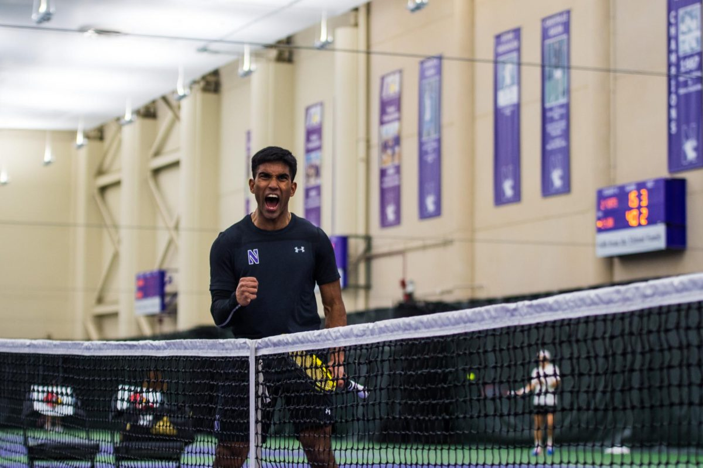
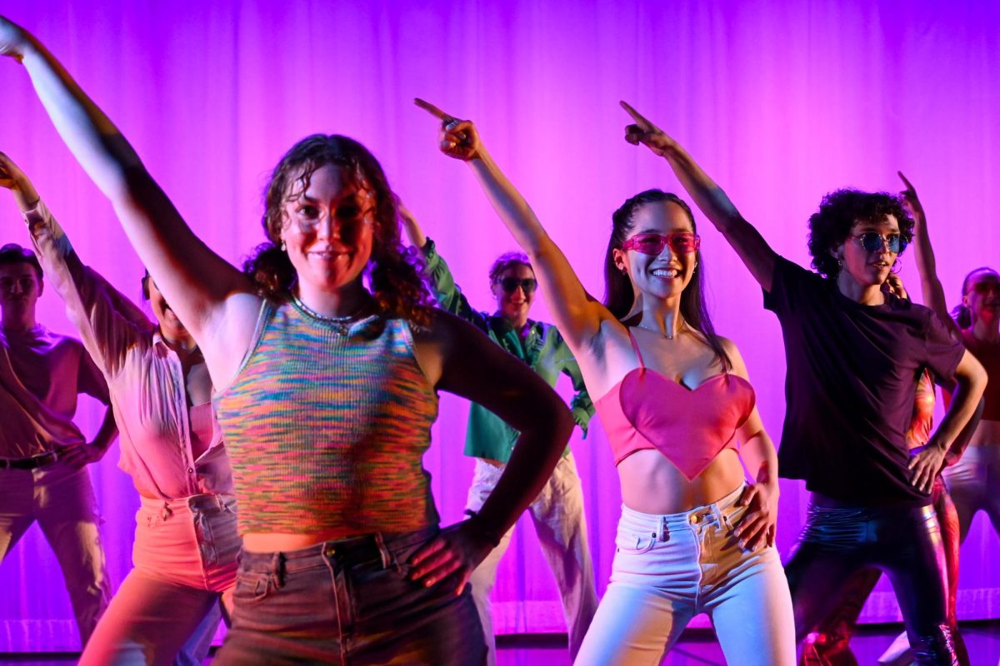
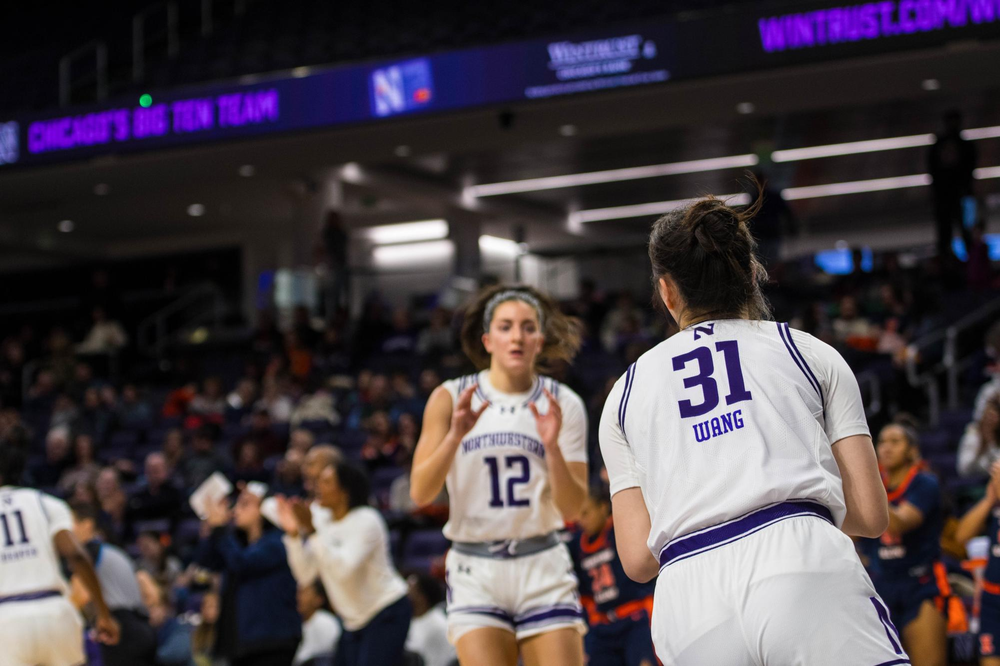
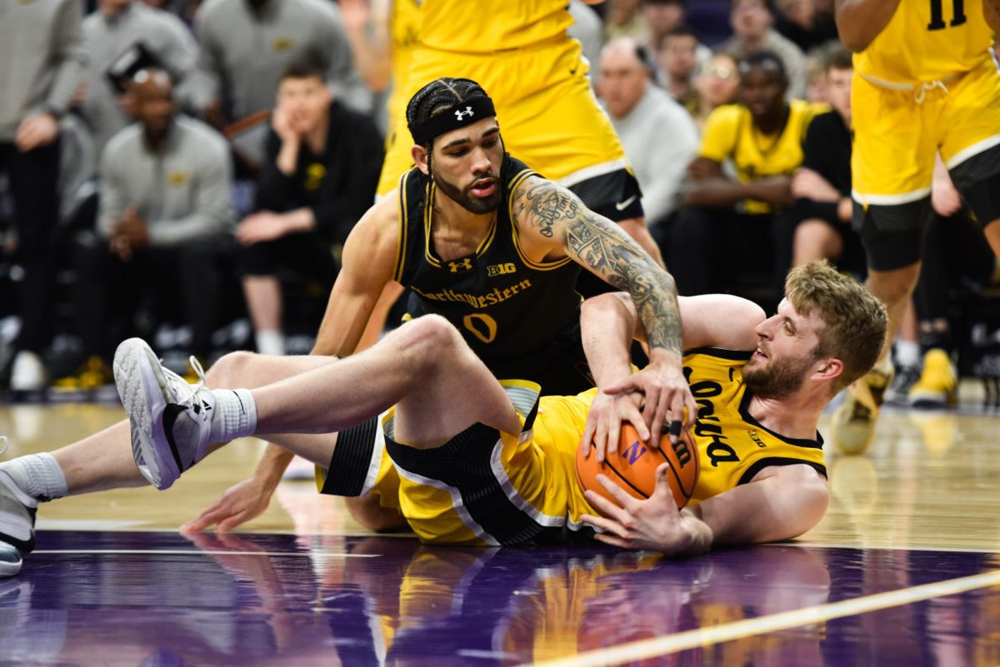
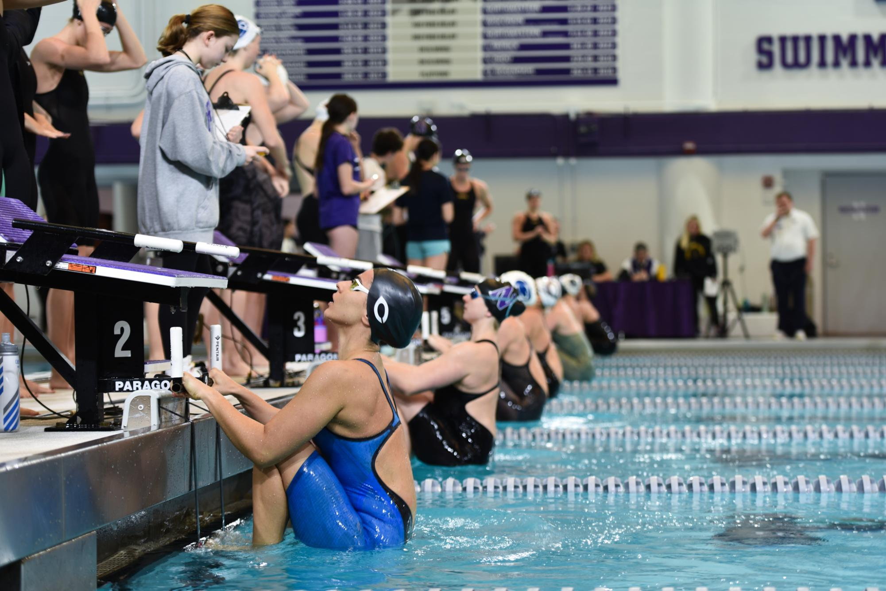
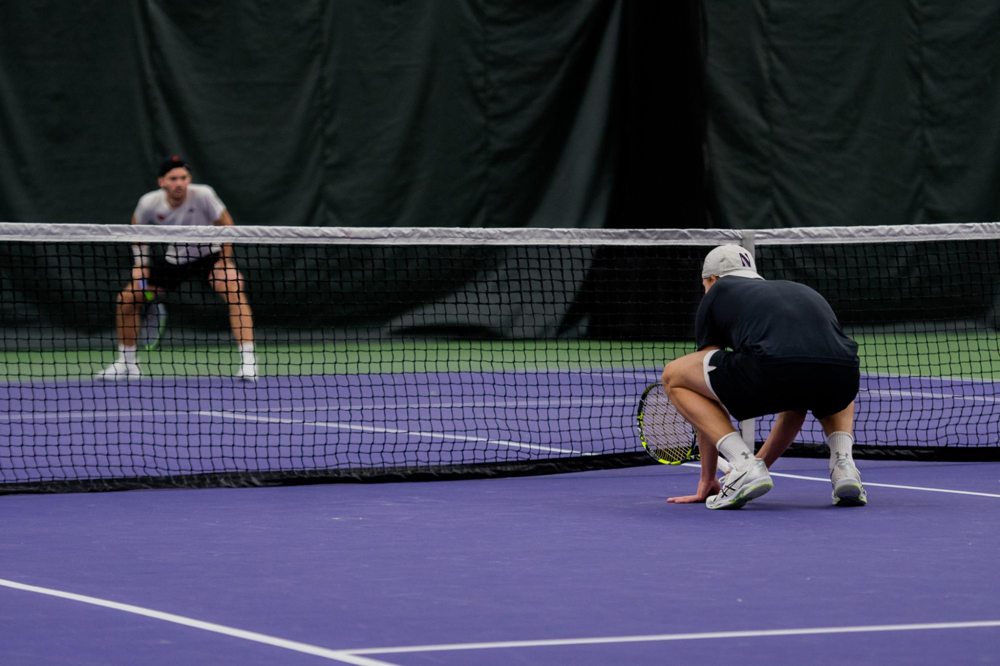
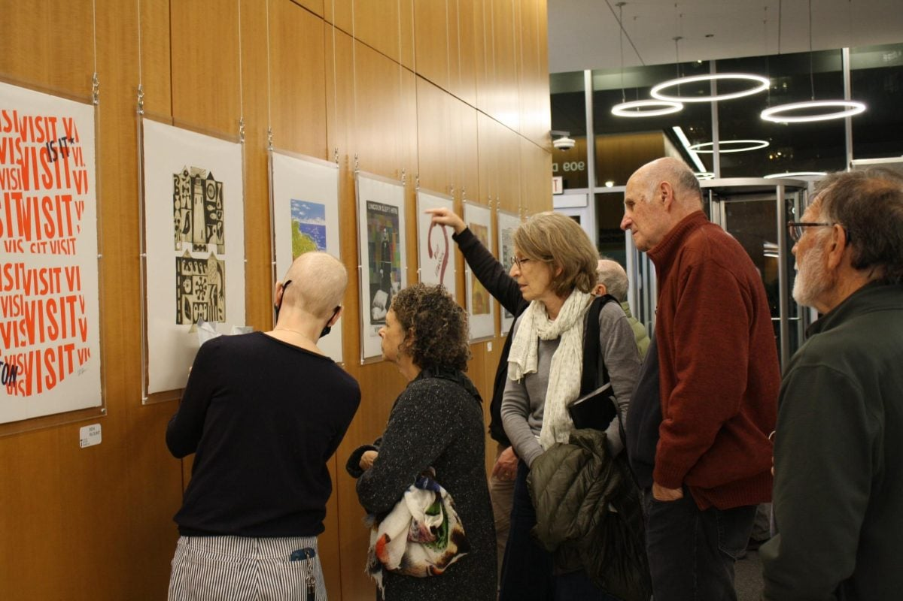

During my time as a reporter and editor for The Daily Northwestern, I had the opportunity to do some sports photojournalism for various Northwestern sports, which was a fun challenge to take on. I also took pictures for stories I wrote for the paper. Check out some of my favorites below. 

::: {layout-ncol="2"}

:::

